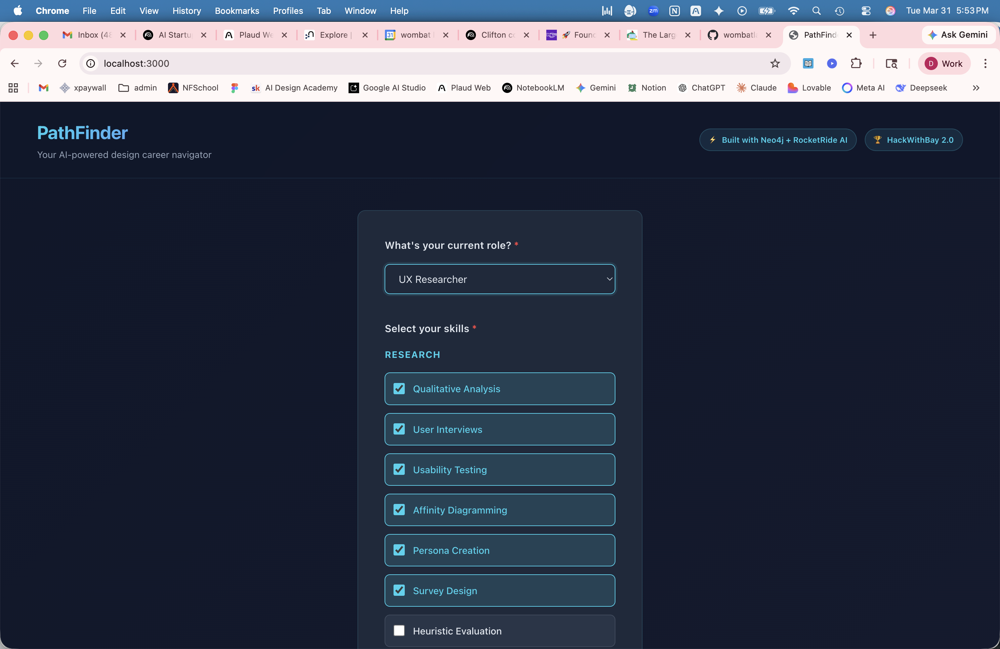
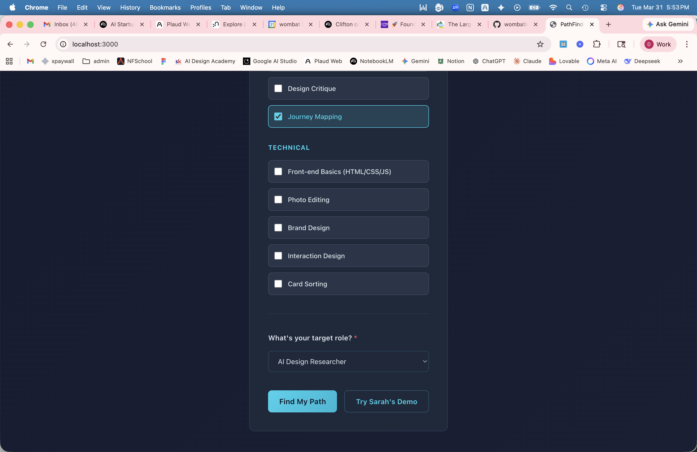
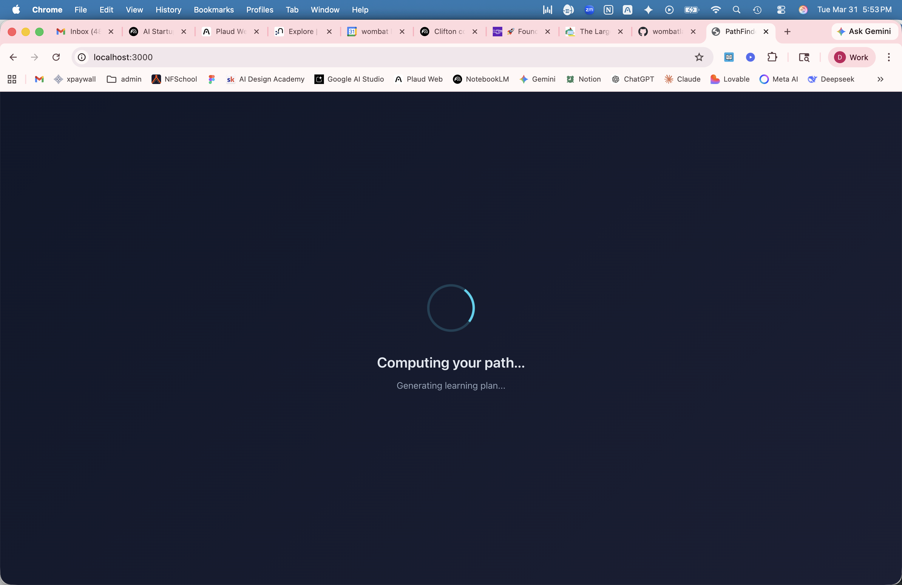
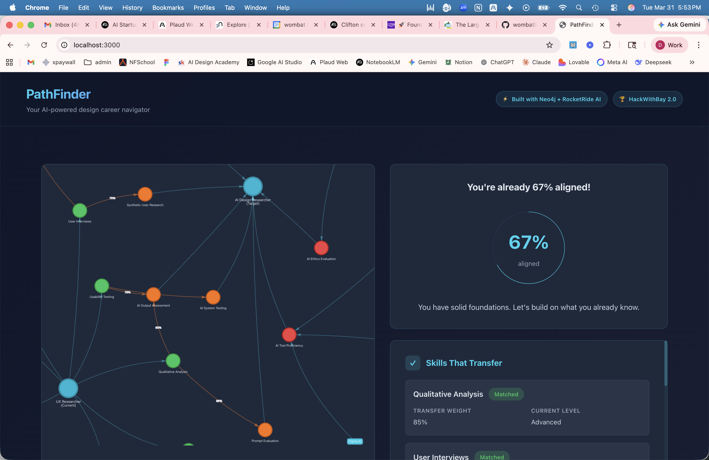
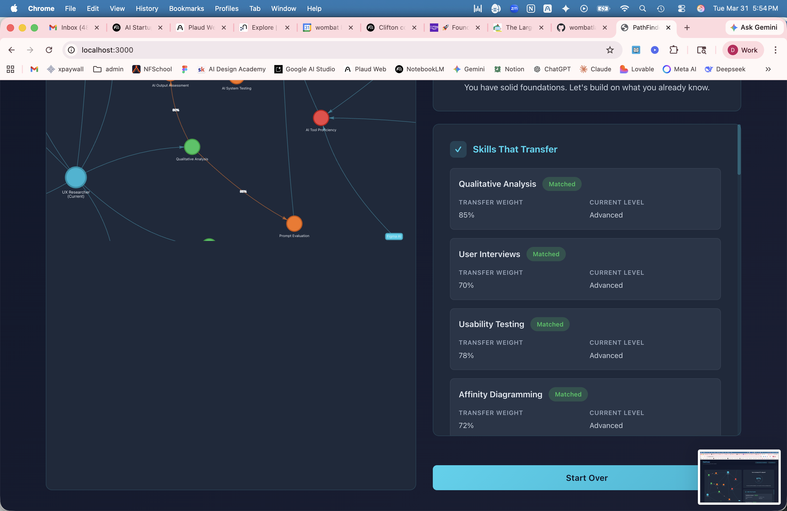
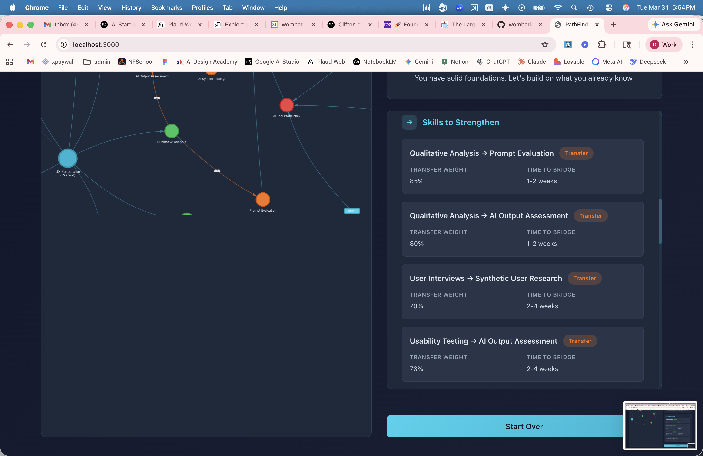
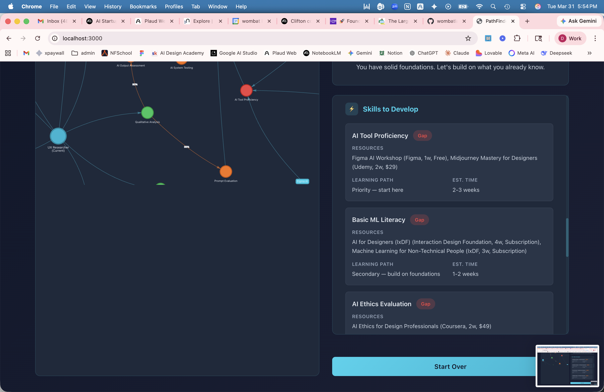
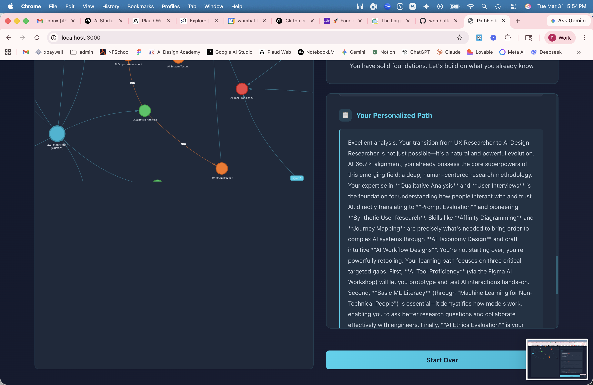
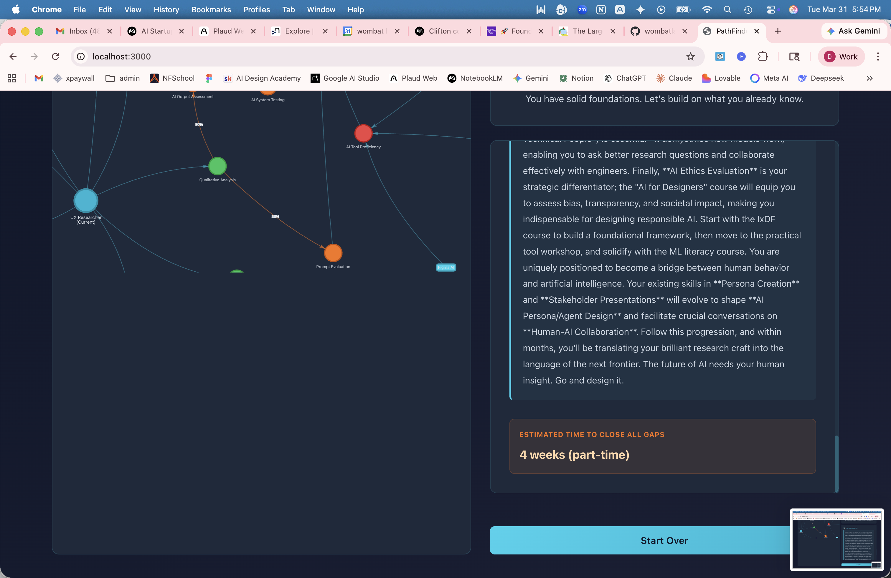

# PathFinder Demo Walkthrough

A visual walkthrough of PathFinder's full user experience, following **Sarah** — a UX Researcher with 7 years of experience who wants to transition into an AI Design Researcher role.

---

## Step 1: Select Your Current Role and Skills

Sarah selects **UX Researcher** as her current role, then checks the design skills she's proficient in: Qualitative Analysis, User Interviews, Usability Testing, Affinity Diagramming, Persona Creation, Survey Design, and Journey Mapping.

---

## Step 2: Choose Your Target Role

She scrolls down and selects **AI Design Researcher** as her target role. She can click "Find My Path" for a live analysis or "Try Sarah's Demo" for the pre-computed showcase.

---

## Step 3: Analysis In Progress

PathFinder queries the Neo4j knowledge graph for skill matches and transfer weights, then calls the LLM to generate a personalized learning plan.

---

## Step 4: Results — Graph Visualization + Alignment Score

The results screen shows two things at once: an **interactive graph visualization** (left) showing how Sarah's skills connect to AI capabilities, and her **67% alignment score** (right) with a summary of her position.

The graph uses color-coded nodes: green for matched skills, orange for transfer capabilities, red for gaps, and purple for recommended courses. Edges show weighted `TRANSFERS_TO` relationships — the core of what makes this a graph problem.

---

## Step 5: Skills That Transfer

PathFinder identifies Sarah's existing skills that directly transfer to the target role. Each shows a **transfer weight** (how strongly the skill maps to an AI capability) and her current proficiency level.

- **Qualitative Analysis** — 85% transfer weight
- **User Interviews** — 70% transfer weight
- **Usability Testing** — 78% transfer weight
- **Affinity Diagramming** — 72% transfer weight

---

## Step 6: Skills to Strengthen

These are transfer opportunities — existing skills that bridge to AI capabilities with specific time-to-bridge estimates. For example, "Qualitative Analysis transfers to Prompt Evaluation" at 85% weight with a 1-2 week bridge time.

---

## Step 7: Skills to Develop (Gap Analysis)

The gap analysis identifies capabilities Sarah needs to build from scratch, each with specific courses, tools, estimated time, and a learning path priority.

- **AI Tool Proficiency** (Gap) — 2-3 weeks, priority: start here
- **Basic ML Literacy** (Gap) — 1-2 weeks, secondary
- **AI Ethics Evaluation** (Gap) — specific course recommendations

---

## Step 8: Personalized Learning Plan

The LLM generates a narrative learning plan that references Sarah's specific skills, explains how they transfer, and lays out a concrete progression. It connects her qualitative analysis background to prompt evaluation, her user interviews to synthetic user research, and maps a path through the three gap areas.

---

## Step 9: Timeline and Next Steps

The plan concludes with an estimated timeline to close all gaps (**4 weeks part-time**) and an encouraging, personalized message about Sarah's career transition.

---

## What's Happening Under the Hood

Each step in this walkthrough maps to real operations:

| What You See | What's Happening |
|---|---|
| Role + skill selection | User input validated against Neo4j schema |
| "Computing your path..." | 4 Cypher queries run against Neo4j Aura (requirements, transfers, roles, courses/tools) |
| Graph visualization | vis-network renders nodes and edges returned from Neo4j |
| Transfer weights (0.85, 0.78...) | `TRANSFERS_TO` edge weights from the knowledge graph |
| Gap analysis | Set difference between required capabilities and covered capabilities |
| Learning plan narrative | LLM (DeepSeek V3.2 via GMI Cloud) generates plan from graph analysis results |

The same logic is modeled as a 6-node RocketRide pipeline — see [`rocketride/pathfinder-pipeline.json`](rocketride/pathfinder-pipeline.json) for the full pipeline definition.
